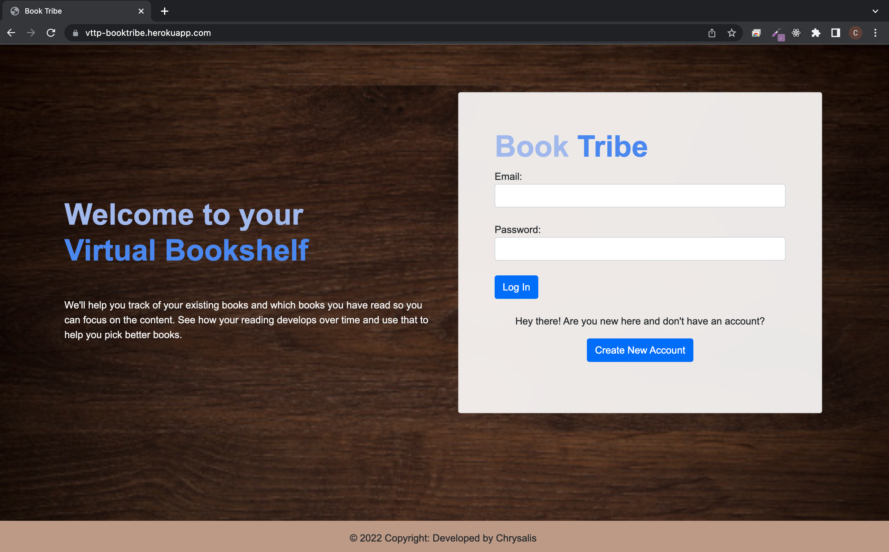

# Login

When users first enter the project, they will see the Login Page. If the user enters an incorrect email / password or if it does not exist, a prompt will appear, and they will not be able to access the app.

<figure><figcaption><p>BookTribe Login Page</p></figcaption></figure>

### Login Controller

In order to get the values from the Login form, we need to use `@RequestBody MultiValueMap<String, String> form`. After which, we will get the specific value using `form.getFirst`.

As the login form checks for several criterias, we will need to use conditional statements to check with the Redis Database if the user exists. If it doesn't, the user is unable to login.

To store the login details of the user, `HttpSession` was used to store the details in a session. As HTTP is a stateless protocol, all requests and responses are independent. The server cannot distinguish between new visitors and returning visitors. But sometimes we may need to keep track of client's activity across multiple requests. This is achieved using Session Management.

```java
 @PostMapping(path = "/login")
    public String postHomePage(Model model, @RequestBody MultiValueMap<String, String> form, HttpSession session) {
        String email = form.getFirst("email");
        String password = form.getFirst("password");

        //? Check with Redis Database
        Boolean loginStatus = userSvc.login(email, password);
        Boolean profileExists = userSvc.checkProfile(email);

        //? If it is wrong, then inform the user that the username and password is incorrect
        if (loginStatus == false) {
            model.addAttribute("loginStatus", loginStatus);

            String errorMessage = "Incorrect email or password";
            model.addAttribute("errorMessage", errorMessage);
            return "login";
        }
        
        //? If it is correct, store in the session and go to the homepage
        User userDetails = userSvc.userDetails(email);
        
        if (profileExists == false) {
            userDetails.setProfile("https://media.istockphoto.com/vectors/default-profile-picture-avatar-photo-placeholder-vector-illustration-vector-id1223671392?k=20&m=1223671392&s=170667a&w=0&h=kEAA35Eaz8k8A3qAGkuY8OZxpfvn9653gDjQwDHZGPE=");
        }
        
        session.setAttribute("userDetails", userDetails);
        model.addAttribute("userDetails", userDetails);
        return "home";
    }
```

### User Service

#### Login Status

```java
    public boolean login(String email, String password) {

        //? Get Redis Value from the Database
        Optional<User> redisValue = userRepo.findUserByEmail(email);

        if (redisValue.isEmpty()) {
            return false;
        } 
        
        //? Check if password is correct
        String redisPassword = redisValue.get().getPassword();
        if (password.equals(redisPassword)) {
            return true;
        }

        return false;
    }
```

#### Check Profile

```java
    public boolean checkProfile(String email) {

        //? Get Redis Value from the Database
        Optional<User> redisValue = userRepo.findUserByEmail(email);

        if (redisValue.isEmpty()) {
            return false;
        } 


        //? Check if the profile exists in Redist
        String redis_profile = redisValue.get().getProfile();
        
        //? Check if password is correct
        if (redis_profile.isBlank()) {
            return false;
        }

        return true;
    }
```

#### User Details

```java
    public User userDetails(String email) {
        Optional<User> userOpt = userRepo.findUserByEmail(email);
        return userOpt.get();
    }
```

