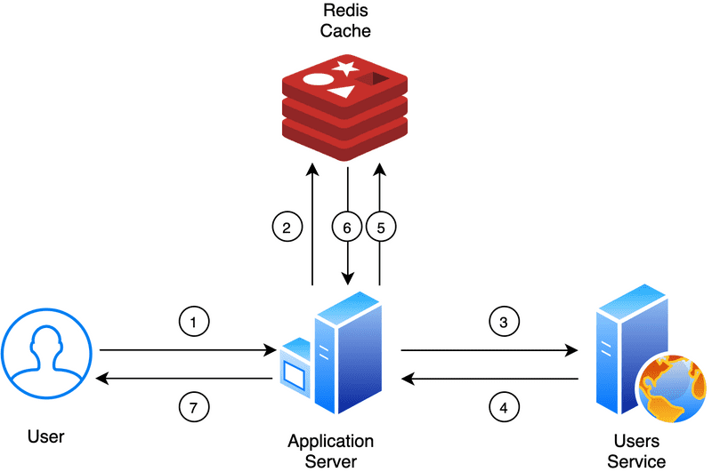

# 💻 Project Set-up

For this project, the database that was used is known as Redis **(REmote DIctionary Server)**.&#x20;

<figure><figcaption><p>Overview of what is Redis</p></figcaption></figure>

#### **Install Redis**

Follow the steps given [here to install Redis Client/Server](https://www.techgeeknext.com/spring-boot/install-redis-on-windows) to test this application.

#### **Create Spring Boot application**

Create Spring Boot application from [Spring Initializr](https://start.spring.io/).

<figure><figcaption></figcaption></figure>

Add these additional dependencies to the `pom.xml` file once the Spring Boot application is initialised.

```
	<dependency>
		<groupId>org.glassfish</groupId>
		<artifactId>jakarta.json</artifactId>
		<version>2.0.1</version>
	</dependency>
```

```
	<dependency>
		<groupId>redis.clients</groupId>
		<artifactId>jedis</artifactId>
		<version>3.9.0</version>
	</dependency>
```

#### Project Structure

.png>)

.png>)

#### 

#### .png>)

#### Redis Configuration

<figure><figcaption></figcaption></figure>
